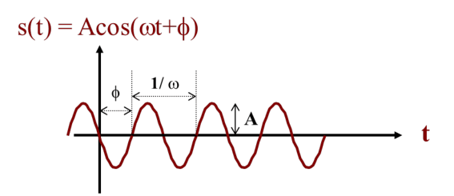

# Introducción {#intro}

## Resumen {-}

La convergencia entre las tecnologías de la información y las comunicaciones es cada vez mayor y las barreras entre ellas se han diluido casi por completo.   Con herramientas como el correo electrónico, la mensajería instantánea, los foros de discusión y las plataformas de trabajo colaborativo, hoy en día la computadora es una innegable herramienta de comunicación.

Las redes de computadoras son un tipo de sistemas de comunicaciones.  Por ello, iniciamos su estudio describiendo los elementos que conforman un sistema de comunicaciones y que están ahí para ofrecer un servicio específico, en nuestro caso, el de interconexión de equipos computacionales.

Más adelante se introducen los conceptos de señal como el elemento físico que se propaga a través de las redes de comunicaciones y se presentan las propiedades que pueden ser alteradas en una señal para transportar información.  Como en las redes de computadoras esta información es digital, también se introducen los mecanismos para transformar una señal análoga (por ejemplo, la voz) en su formato binario.

Un requerimiento fundamental para  que las redes sean técnica y económicamente viables, es la capacidad de compartir los canales de comunicación (cables eléctricos, espectro electromagnético, enlaces de fibra óptica).  Por ello, es muy importante  asimilar los conceptos de conmutación y de multiplexaje.   

Una vez presentados los conceptos de sistemas de comunicaciones, entramos en el mundo de las redes de computadoras.  Interconectar un conjunto de computadoras es un problema sumamente complejo que involucra desde las propiedades físicas de las señales y los canales de comunicación, hasta la representación interna de los datos que utiliza cada fabricante de computadoras, pasando por cómo establecer las trayectorias más apropiadas para enlazar las computadoras.
Ello da lugar a arquitecturas o modelos de redes donde el problema de interconexión se divide en tareas concretas, más sencillas. 

La arquitectura de redes más popular en el ámbito académico, es el modelo de capas OSI (*Open Systems Interconnection*). Se trata de un modelo de siete capas en el que la capa inferior ofrece un servicio a la capa superior, hasta resolver completamente la complejidad de la interconexión.  El modelo OSI también define la terminología común a las redes de computadoras, como protocolo, punto de acceso a servicio, nodo de interconexión, etcétera.

Internet también sigue un modelo de capas, pero solo define formalmente tres, y se considera agnóstico a las llamadas "capas inferiores", que son las responsables del transporte de datos.

Cerramos este capítulo con una breve taxonomía de las redes de computadoras en función de su área de cobertura.

## Conceptos básicos {#requisitos}

Durante las últimas décadas los campos de la informática y las telecomunicaciones se han fusionado, generando profundos cambios en la tecnología, los productos y las compañías de esta nueva industria combinada [@Stallings:DCC], llamada Tecnologías de Información y de Comunicaciones TIC. La revolución generada por esta simbiosis ha afectado significativamente el tejido económico y social del mundo. Las redes digitales se están convirtiendo en el sistema nervioso de la Sociedad de la Información. Para Castells [@Castells:RNS], *La Red* significa nuevas formas de organización que reemplazan jerarquías verticales integradas como la manera dominante de organización social.

De acuerdo a la Unión Internacional de Telecomunicaciones (UIT, *Internationa Telecommunications Union*) el desarrollo dentro del sector de las TIC, puede ilustrarse en tres fases u olas de cambios tecnológicos [@ICT:RT]: 
<dl>
<dt><strong>La primera ola</strong></dt> 
<dd>Está caracterizada por profundos cambios tecnológicos que dieron lugar a la digitalización, la computarización y la aparición de las redes de conmutación de paquetes, conceptos que serán tratados más adelante.  

Con esta primera ola se consiguió una mejora en la utilización de los recursos y un incremento en la capacidad de las redes de comunicación. Esto posibilitó la creación de nuevos servicios y cimentó un entorno de sinergia que aceleró el desarrollo tecnológico.

Al convertir todo tipo de fuente de información en un patrón binario (o digital), la digitalización posibilita la integración de diferentes servicios en la misma red, mejorando sus prestaciones a través de procesos como la compresión, la modularización y la detección y corrección anticipada de errores (FEC, *Forward Error Correction*).

Con las fuentes de información digitalizadas, éstas pueden manipuladas automáticamente con programas informáticos.  Esta computarización puede ocurrir dentro de la red misma, dotando de inteligencia a los nodos encargados de encaminar la información de un usuario a otro de la red.  

Como se mostrará más adelante, esta capacidad de procesamiento en los nodos es la base de las redes de conmutación de paquetes, caracterizadas por un uso sumamente eficiente de los recursos disponibles.  Esta técnica de conmutación ha sido utilizada en prácticamente todas las arquitecturas de red para transferencia de datos (como X.25, Frame Relay, SNA y ATM) incluyendo, desde luego, aquellas basadas en los protocolos TCP/IP,  notablemente la Internet.</dd>

<dt><strong>La segunda ola</dt></strong> 
<dd>Es representada por el crecimiento explosivo de las redes de comunicaciones, notablemente la telefonía móvil y la creciente penetración de Internet en la sociedad.  Resulta natural que todas estas redes converjan y se complementen entre sí, como de hecho está ocurriendo: En la actualidad, las redes móviles son la principal tecnología de acceso a Internet, mientras que las redes llamadas de cuarta generación (basadas, por ejemplo, en LTE, *Long Term Evolution*) son redes de conmutación de paquetes en las que las comunicaciones de voz son sólo un servicio más dentro de todos los que se espera sean ofrecidos por estas redes.

Todo lo anterior ha llevado a la llamada convergencia digital la cual está ocurriendo en diferentes niveles [@OECD:BS]:


- En el nivel de contenidos, por ejemplo, con la aparición de los servicios de Video en Demanda (*Video on Demand*) y la televisión sobre el protocolo de Internet (IPTV);
- A nivel de negocios, con esquemas de propiedad cruzada y los servicios triple-play (datos, voz y video) ofrecidos por operadores de telecomunicaciones;
- A nivel de red con la aparición de redes unificadas para la transmisión de señales;
- A nivel de dispositivos, con dispositivos de propósito múltiple

</dd>

<dt><strong>La tercera ola</dt></strong> 
<dd>Va mucho más allá de los desarrollos tecnológicos (y del alcance de este curso), y consiste en el desarrollo de servicios, aplicaciones, contenidos y procesos de apropiación que permitan transitar de una sociedad que usa las TIC, pasando por una sociedad capaz de generar información apoyada en ellas, hacia una sociedad basada en el conocimiento.</dd>

</dl>

Así, las redes de comunicaciones son vitales para las sociedades contemporáneas, y es por ello que resulta conveniente entender con claridad los fundamentos técnicos en que se sustentan.

### Sistemas de comunicaciones

Etimológicamente, la palabra telecomunicación está formada por el prefijo griego *tele* que significa "a distancia" y la raíz latina *comunicare*, "hacer común".  Así, las telecomunicaciones representan el acto de hacer común, de compartir *algo* entre dos o más entidades que se encuentran físicamente separadas.

Para llevar esta definición a ejemplos concretos, ese *algo* es información (o conocimiento) que puede ser expresado a través de la voz (tele-fonía), de imágenes (tele-visión) o de símbolos (tele-grafía) y que requiere de un sistema que posibilite esta comunicación a la distancia.  

En su forma más general, un sistema de comunicaciones está compuesto por los bloques que se ilustran en la 
figura \@ref(fig:sistcom):
  
```{r, sistcom, echo=FALSE, fig.align='center', fig.cap='Sistema de comunicaciones básico'}
knitr::include_graphics("figuras/c1/sistcom-1.png")
```

La fuente es la que genera la información y emite mensajes para uno o más destinatarios. La fuente de información puede generar señales analógicas o digitales (ver más adelante). La transferencia de información entre el emisor y el(los) receptor(es), se lleva a través de un canal de comunicación, como puede ser un cable de cobre, una fibra óptica o el espectro radioeléctrico.  Cuando las señales viajan a través del canal, necesariamente sufren perturbaciones impredecibles producidas por la naturaleza del canal o por elementos externos al sistema (por ejemplo, atenuaciones debido a la resistividad del medio, interferencia de otras fuentes, distorsión por las propiedades del medio) y que en conjunto se conocen como fuentes de ruido.

En el sistema de comunicaciones, el transmisor consiste de un conjunto de elementos (como moduladores, codificadores, amplificadores) que permiten adecuar las señales generadas por las fuentes de información a las condiciones del canal de comunicación y de protegerlas, en la medida de lo posible, de las fuentes de ruido a las que serán sometidas.  Al otro extremo del canal, el receptor realiza un proceso inverso para recuperar la señal original y entregarla al destinatario.

### Redes de telecomunicaciones

Los sistemas de comunicaciones han ido evolucionando y se han convertido hoy en sistemas complejos interconectados por distintos medios para proporcionar un conjunto de servicios. Estos sistemas son las redes de telecomunicaciones y, en términos generales, deben ser capaces de:

- Proveer un camino entre usuarios y usuarios, y entre usuarios y servicios;
- posibilitar a cada usuario para que pueda seleccionar a sus destinatarios;
- proveer servicios con calidad, aún en periodos de gran actividad;
- proporcionar mecanismos de control y gestión.

La posibilidad de una red de procesar y transmitir información del tipo deseado por los usuarios, es el "servicio" proporcionado por dicha red. Los usuarios pueden ser finales (suscriptores) o intermedios (otras redes).  Algunos ejemplos de servicios, son los siguientes:

- Telefónico local
- Video transmisión
- Tránsito
- Acceso a internet 
- Acceso a red de abonado

### Señal

Un sistema analógico (o análogo) utiliza una cantidad física, como el voltaje, para representar el comportamiento de otro sistema físico. Las propiedades de esta representación son explotadas para almacenar, transformar, duplicar o amplificar el fenómeno original. Las señales utilizadas en un sistema analógico son continuas, por lo que pueden tomar un número potencialmente infinito de valores. 

Hay muchos ejemplos de señales analógicas en la naturaleza, como el sonido, la temperatura ambiente o la intensidad de una fuente de luz (por supuesto, sin considerar los procesos que ocurren a nivel de la física cuántica).  De forma similar, la altura de una rampa varía de forma continua y su valor en un punto determinado solo puede ser establecida limitando la resolución del dispositivo utilizado para efectuar la medición. 

Una desventaja de un sistema  analógico es la acumulación de pequeñas variaciones aleatorias cada vez que se realiza una operación sobre la señal adquirida. Por ejemplo, en el caso específico de un sistema eléctrico, siempre existen perturbaciones debidas al movimiento molecular (ruido  térmico). 

Por su parte, una señal digital solo puede tomar valores discretos y cuantificables del fenómeno físico.  Por ejemplo, el número de árboles en un predio o el nivel de los peldaños en una escalera.  

Una señal analógica puede ser convertida en una señal digital. A este proceso se le llama digitalización, lo cual, como se mostrará más adelante, ofrece una gran flexibilidad para manipular la señal.  Conviene recordar que la digitalización es uno de los detonadores de la primera ola en el desarrollo de las TIC.

Por comodidad vamos a trabajar con señales senoidales simples como la que aparece en la figura.  Como lo demuestra el Teorema de Fourier, cualquier señal periodica puede aproximarse como una suma de funciones senoidales^[Si bien la suma puede ser infinita, en general basta con un número relativamente pequeño de componentes senoidales para representar con una precisión aceptable la señal]. 

Una señal senoidal pura se muestra en la figura \@ref(fig:senoidal) representada como $s(t)$.  Las propiedades de la señal que pueden ser manipuladas para transportar información, son su amplitud ($A$), su frecuencia ($\omega$) y su fase ($\phi$).  La amplitud es la magnitud máxima que puede tomar la señal.  El tiempo que le toma a una señal desplegar una oscilación completa, se conoce como periodo y su inverso es la frecuencia $\omega$, que indica el número de oscilaciones por segundo que realiza $s(t)$.  La frecuencia se mide en Hertz.  La separación (medida en grados o radianes) de un punto de referencia arbitrario al inicio de un ciclo, es lo que se conoce como fase y se representa por $\phi$.
  
```{r, senoidal, echo=FALSE, fig.align='center', fig.cap='*Señal senoidal.*'}

```

### Conversión analógica a digital (A/D)

La representación digital de una señal analógica se construye en las tres fases mostradas en la figura \@ref(fig:conversionad).  El proceso inicia obteniendo muestras de la magnitud a intervalos regulares (muestreo). A cada muestra obtenida se le asigna el más cercano de un conjunto finito de valores  (cuantización). El valor seleccionado se codifica, utilizando típicamente una representación binaria (codificación).
  
```{r, conversionad, echo=FALSE, fig.align='center', fig.cap='*Proceso de conversión de una señal analógica a digital.*'}
knitr::include_graphics("figuras/c1/conversionad-1.png")
```

La cuantización implica una distorsión de la señal original (llamada error de cuantización) pues, en general, el valor discreto que representa la muestra no coincidirá exactamente con su magnitud en ese punto (ver figura \@ref(fig:mu-y-cuant)). En cambio, la señal digital es mucho más inmune a factores externos (las fuentes de ruido de la figura \@ref(fig:sistcom)) que alteran la magnitud de la señal.

```{r, mu-y-cuant, echo=FALSE, fig.align='center', fig.cap='*Muestreo y cuantización de una señal analógica.*'}

```

Finalmente, cada muestra cuantizada es representada por un valor binario (figura \@ref(fig:coddig)). El conjunto de valores utilizados para la representación digital debe elegirse con cuidado. Entre mayor sea el conjunto menor será la separación entre ellos, y por consiguiente, el error de cuantización será menor. Sin embargo, el patrón binario (es decir, el número de bits) para representar estos valores aumenta. 

```{r, coddig, echo=FALSE, fig.align='center', fig.cap='*Codificación de la señal cuantizada.*'}

```

Por simplicidad, en el ejemplo anterior se ha elegido un código de tres bits. Con tres bits, se tienen $2^3=8~$niveles discretos. Cada magnitud muestreada se aproxima al nivel más cercano de ellos.

> El proceso de digitalización anterior, en el que cada muestra es convertida al valor discreto más cercano y codificada en una serie de pulsos binarios, también se le conoce como **Modulación por Codificación de Pulsos** (PCM, *Pulse Code Modulation*).

#### Teorema de Nyquist {-}

Para reconstruir la señal analógica se recurre a un proceso matemático de interpolación. En 1924, Henry Nyquist mostró, a través del teorema que lleva su nombre, que para obtener una reconstrucción completa, bastaba con tomar muestras al doble de la frecuencia máxima de la señal original^[Recordemos que una señal compleja puede representarse por una suma de señales senoidales]. En consecuencia, es necesario conocer el rango de frecuencias de la señal (es decir, su *ancho de banda*, determinar la frecuencia más alta y muestrear al doble de este valor para que la señal digital retenga las propiedades de la original.

> <dl>
<dt><strong><font color="blue">Caso de estudio.</font></strong></dt>
<dd>
Es ilustrativo ejemplificar los conceptos de conversión A/D en el marco de las redes telefónicas digitales. 
>
> La voz está formada por señales que tienen componentes de frecuencia más allá de los 12,000 Hz. Sin embargo, los componentes principales de la voz, es decir, aquellos que permiten distinguir con claridad el  mensaje emitido, se encuentran en el rango de 300 Hz a 3,400 Hz. 
>
> En las redes telefónicas digitales se  transforma la voz en una señal eléctrica que es sensada cada 125\,ms, obteniendo 8,000 muestras por segundo, es decir, un poco más del doble requerido por el teorema a de Nyquist. 
>
> Cada valor se representa con un número binario de 8 bits (se tienen $2^8=256\,$ niveles discretos), por lo que la señal digital tiene una tasa de $64\,kb/s$.
>
> Por supuesto, si se comprimen las señales digitalizadas, se requerirá de una tasa de transferencia menor.
</dd>
</dl>

Si se capturan menos de dos muestras por ciclo (es decir, si se muestra a menos del doble de la frecuencia máxima), entonces la señal que se generaría a partir de las muestras tomadas, no es la original, sino una en la que se han perdido algunas de sus propiedades.  Por ejemplo, en la figura \@ref(fig:nyqalias), los puntos azules se capturan a una tasa notablemente menor a $2f_{max}$, lo que genera la señal representada por la línea azul punteada. 
  
```{r, nyqalias, echo=FALSE, fig.align='center', fig.cap='*Efecto de muestreo a una tasa menor a la frecuencia de Nyquist.*'}

```


Si bien el proceso de digitalización introduce una cierta complejidad en el tratamiento de la señal original, la representación digital de la información tiene enormes ventajas para poder procesarla (por ejemplo, para comprimirla, transformarla, analizarla mediante programas de cómputo), almacenarla (por ejemplo, en un archivo) y transportarla en sistemas de comunicaciones digitales. Es por ello que en la actualidad, prácticamente todos los sistemas de comunicaciones están convergiendo hacia su digitalización.

El teorema de Nyquist, además de indicar el número de muestras necesario para reconstruir una señal analógica a partir de la representación digital, fija el límite máximo de la cantidad de información que puede ser transmitida a través de un canal sin ruido. 

Si la digitalización se realiza al doble de la frecuencia máxima de la señal original ($H$)  y si se utilizan $V$ niveles discretos, entonces:
$$
\text{Tasa máxima de datos} = 2H \log_2 (V)\,b/s
$$

Claude Shannon extiende en 1948 el trabajo original de Nyquist  para canales con presencia de ruido [@Tanenbaum:CN]. Si la cantidad de ruido en el canal se obtiene a partir la relación entre la potencia de la señal a trasmitir ($S$) y la potencia del ruido presente ($N$), entonces la tasa ideal de un canal con ancho de banda $H$ y radio señal a ruido (SNR, *signal to noise ratio*) $S/N$ es:
$$
\text{Tasa máxima de datos} = H  \log_2 (1 + \frac{S}{N})\,b/s
$$

Este resultado es muy importante porque, además de ofrecer el límite teórico de la capacidad de un canal, indica que cualquier mensaje puede ser transmitido con confiabilidad, a pesar de tener un canal con ruido, diseñando una codificación que mejore la relación señal a ruido [@Rheingold:TFT].

## Conmutación

### Conmutación de mensajes

### Conmutación de circuitos

### Conmutación de paquetes

## Multiplexaje

### Multiplexaje en el tiempo

### Multiplexaje en frecuencia

### Multiplexaje por división de código

### Multiplexaje espacial

## Arquitecturas de red

### Modelo ISO/OSI

### Modelo TCP/IP

### Encapsulamiento

## Taxonomía

## Problemas
